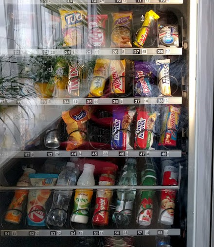

# Дизайн торгвого автомата

Как Вы спроектируете Торговый автомат в Java? Это один из хороших вопросов на интервью по Java, который может быть задан на собеседованиях уровня Senior developer. Вам будет дана постановка задачи разработать Торговый автомат. В течение ограниченного времени, как правило, 2-3 часа, вам необходимо  спроектировать  дизайн, написать рабочий код и unit тесты на Java.

Одним из ключевых преимуществ таких Java интервью является, что  сразу можно проверить многие основные навыки кандидата. Для завершения проектирования, кодирования и unit тестирования торгового автомата, кандидат должен быть действительно хороший во всех трех областях. Кстати, подобные задачи из реального мира  является хорошими упражнениями для улучшения навыков объектно ориентированного анализа и дизайна ([смотри тут](http://javarevisited.blogspot.sg/2014/01/10-tips-to-improve-programming-skill-become-better-programmer.html)), который является очень важным, если вы хотите стать хорошим разработчиком.

Разрабатывая автомат в Java или любом другом объектно ориентированным языке, вы не только изучаете основы например, инкапсуляция, полиморфизм или наследования, но также узнаете тонкие детали о том, как использовать абстрактный класс и интерфейс (см. здесь) при решении задач или разработке приложения.

Как правило такого рода задачи дают возможность использовать шаблоны проектирования Java, например, в этой задаче будет использован  шаблон фабрики для создания различных типов торговых автоматов. Об этом можно почитать ([здесь](http://javarevisited.blogspot.com/2012/03/10-object-oriented-design-principles.html)).

Этоа серия из двух статей будет показывать решение задачи по созданию торгового автомата в Java. Кстати, эта задача  может быть решена различными способами. Это также дает возможность пересмотреть принципы проектирования SOLID и ООП паттерны (см. здесь) и уметь использовать их в коде. 

# Постановка задачи

Вам необходимо разработать Торговый автомат который:

1. Принимает монеты определенного номинала.
2. Предоставляет возможность пользователю выбрать продукты.
3. Разрешите клиенту получить возврат денег в случае отмены заказа.
4. Выдать выбранные товар и если необходимо сдачу
5. Обеспечить возможность выполнить операцию сброса для сервисного обслуживания.

Постановка задачи является наиболее важной частью. Нужно несколько раз перечитать постановку чтобы как можно лучше понять суть проблемы и то, что вы пытаетесь решить. Обычно [требования не очень ясны](http://javarevisited.blogspot.com/2015/01/difference-between-functional-and-nonfunctional-requirements-software-development.html) и вам, читая постановку задачи, нужно составить их перечень самостоятельно.

Мне нравится требования составленные в виде списков, потому что их легко отслеживать. Некоторые требования могут быть неявные, поэтому в вашем списке лучше их сделать явными. Например в этой задаче, автомат не должен продавать товар, если нет необходимых средств на сдачу.

К сожалению, существует не много книгу или курсов, которые научат вас этим навыкам. Необходимо развивать их самостоятельно, выполняя реальные задачи. Хотя, две книги, которые помогли мне улучшить навыки объектно ориентированного анализа и проектирования это [Head First Object Oriented Design and Analysis](http://www.amazon.com/dp/0596008678/?tag=javamysqlanta-20) 1-е издание, Бретт Маклафлин. Одна из лучших книги, если у вас нет большого опыта работы в объектно-ориентированном программировании.

Еще одна очень хорошая книга по разработке приложений и дизайну систем дизайн это [UML for Java Programmers by Robert C. Martin](http://www.amazon.com/UML-Java%C2%BF-Programmers-Robert-Martin/dp/0131428489?tag=javamysqlanta-20), один из моих любимых авторов. Я прочитал несколько книг о нем, например "Clean Code", "Clean Coder" и книгу по разработке программного обеспечения с использованием Agile. Он является одним из лучших в преподавании OOП концепции.

В этой книге рассматривается аналогичная задача о проектировании кофе-машины. Так что, если вы хотите попрактиковаться или проверить навыки ООД, вы можете обратиться к этой проблеме. Также это очень хорошее упражнение для обучения.

# Решение и Код

Моя реализация торгового автомата содержит следующие классы и интерфейсы:

#### VendingMachine

Класс определяет публичный API торгового автомата, как правило, все функции высокого уровня должны быть описаны в этом классе

#### VendingMachineImpl

Пример реализации торгового автомата

#### VendingMachineFactory
 
Класс-фабрика для создания различных видов торговых автоматов

#### Item
 
Перечисляемый тип чтобы описать набор товаров продаваемых торговым автоматом

#### Inventory
 
Класс для учета, используется для учета товаров и денег внутри торгового автомата

#### Coin
 
Перечисляемый тип для описания монет поддерживаемых торговым автоматом

#### Bucket
 
Обобщенный класс для хранения двух объектов. 

#### NotFullPaidException
 
Исключение возникает, когда пользователь пытается забрать товар, не заплатив полную сумму.

#### NotSufficientChangeException
 
Торговый автомат выдает это исключение, чтобы показать, нет необходимой суммы на сдачу.

#### SoldOutExcepiton
 
Исключение возникает если пользователь хочет приобрести продукт который уже продан.

## Как разработать торговый автомат на Java
Вот полный код торгово автомата, протестируйте код и дайте мне знать, если будут какие либо ошибки.

Код реализации из статьи можно посмотреть по [тут](https://github.com/47niemand/learning-java-vending-machine-example.git).

#### VendingMachine.java

>Публичный интерфейс торгового автомата, как правило, все функциональные возможности высокого уровня должны быть описаны в нем

#### VendingMachineImpl.java

>Пример реализации интерфейса автомата. Предоставляет собой реальный автомат, который есть в вашем офисе, на автобусной остановке, или общественных местах

#### VendingMachineFactory.java

Класс-фабрика для создания различных видов торговых автоматов

#### Item.java

>Перечисляемый тип чтобы описать набор товаров продаваемых торговым автоматом

#### Inventory.java

>Класс используется для учета товаров и денег внутри торгового автомата.

#### VendingMachine.java

>Интерфейс торгового автомата, все функциональные возможности высокого уровня должны быть описаны тут.

#### Bucket.java

>Обобщенный служебный класс для хранения пары объектов.

#### NotFullPaidException.java

>Исключение вникающее когда пользователь пытается получить товар, не заплатив полную сумму.

#### NotSufficientChangeException.java

>Исключение чтобы показать, что торговый автомат не содержит достаточно монет для выполнения запроса.

#### SoldOutException.java

>Исключение вникающее если будет запрошен уже проданный товар.

---
На этом все в первой части статьи **, как спроектировать автомат по продаже в Java **. В этой части, мы решили эту проблему, создав все классы и написали весь код, пока unit тестирование и документа дизайна не реализованы, они будут во второй части этой статьи.

Если вы хотите, вы можете проверить работу это приложение создав необходимые unit тесты, или реализовать это приложение использую потоки, чтобы отдельный поток выполнял роль пользователя.

>Design a Vending Machine in Java - Interview Question
Read more: http://javarevisited.blogspot.com/2016/06/design-vending-machine-in-java.html